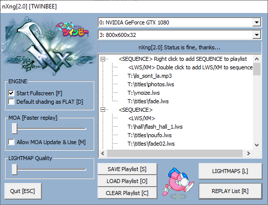
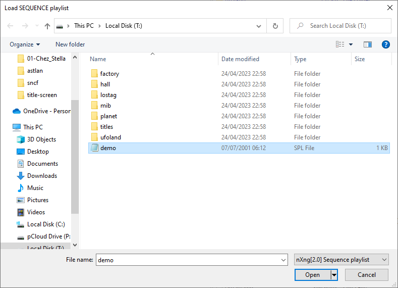
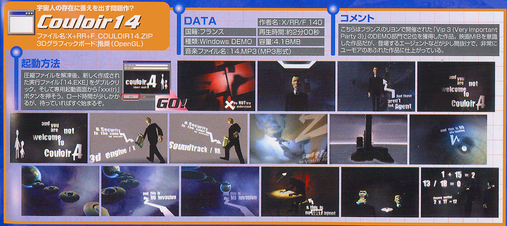
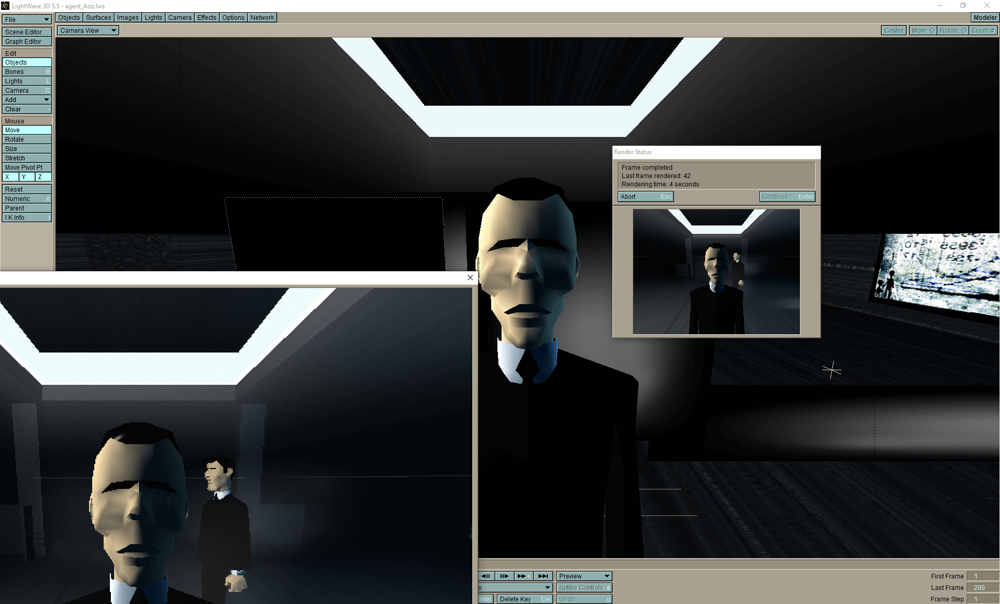
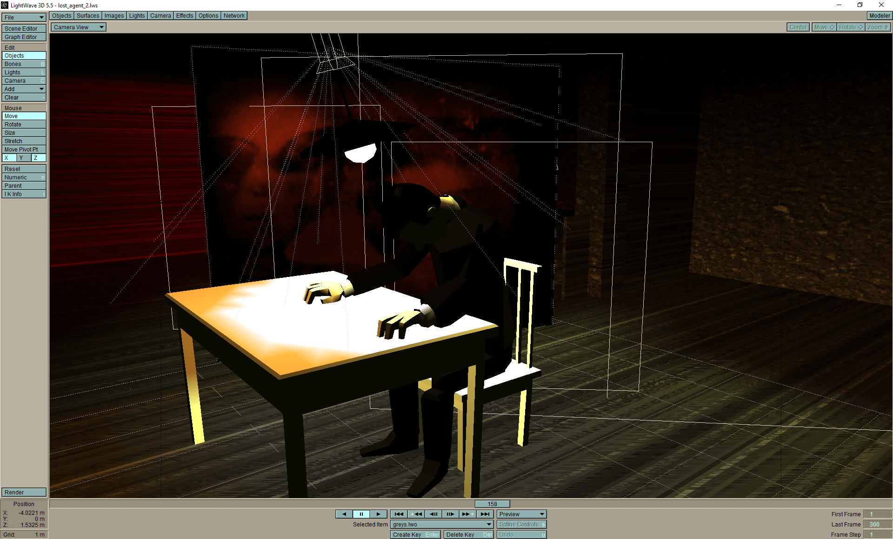
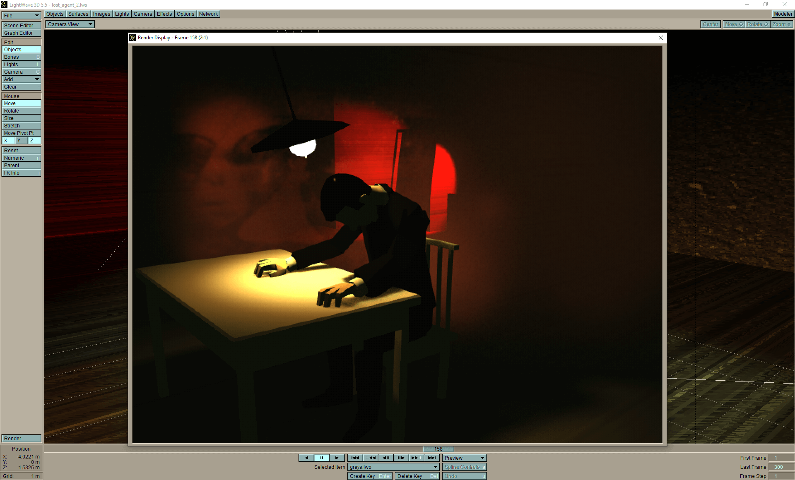

_Couloir 14, based on found documents_

 

# Couloir 14, graphic assets

:floppy_disk: This repository contains the graphic sources for the demoscene production **Couloir 14**. These sources are mostly made up of [Lightwave 3D 5.5](https://en.wikipedia.org/wiki/LightWave_3D) files (.lws, .lwo, .jpg, .tga). The demo is essentially a script of Lightwave scenes replayed by an [extremely sophisticated player](https://www.pouet.net/prod.php?which=93899).

## Running the Demo

To run the demo from the assets, you need to follow these steps:

1. Download the original scene player developed by XBarr:
  - found in [demo-couloir14-assets/S3DE_player](demo-couloir14-assets/S3DE_player)
  - or from https://github.com/demoscene-source-archive/preservation-nxng-engine
2. Edit the file `mount_folder_1st.bat` to set the local folder where the assets were cloned.
3. Start the Scene player (`nX_S3DE.exe`).
4. Load the playlist file `demo.spl`.
5. Select your screen resolution, click on `Fullscreen`.
6. Click on `Replay`.

The demo can be seen on Youtube as well: [www.youtube.com/watch?v=TZlOK5H9qtE](https://www.youtube.com/watch?v=TZlOK5H9qtE)

> **Notes on Folder Structure**

 It's crucial to set up the correct folder structure for the demo to work properly. You will need to mount the local folder containing the assets to the folder that is referenced throughout the Lightwave files (in this case, `T:\`).

 For example, if your local folder is `C:/Couloir14/assets`, you would need to edit the file `mount_folder_1st.bat` (that is essentially doing a `subst` MS-DOS command).
 
 
_the nXng interface_

 
_the playlist selector_

## Credits
- 3D graphics and overall design by [Astrofra](https://github.com/astrofra/) (aka [Fra](https://www.pouet.net/user.php?who=940&show=credits))
- 3D engine & additionnal code by [XBarr](https://github.com/ejulien/) (aka [XBarr](https://www.pouet.net/user.php?who=940&show=credits))
- [Music](https://github.com/astrofra/couloir14/raw/main/demo-couloir14-assets/assets/ils_sont_la.mp3) by [RR](https://www.pouet.net/user.php?who=479&show=credits)

# About this demoscene production

:pill: Introducing "C̴o̵u̵l̶o̵i̸r̵ ̶1̵4," a c̵o̸n̵t̷r̵o̶v̵e̶r̵s̷i̵a̸l̵ demoscene *production* released in 2001 that has p̸u̵z̶z̵l̸e̵d̸ the m̶i̵n̸d̵s̸ of enthusiasts and experts alike. This p̸e̵r̸p̵l̷e̵x̶i̸n̵g̵ creation is infamous for its *p̵o̸l̵a̴r̵i̶z̸i̴n̴g̷* visuals, d̴i̷s̵s̷o̵n̸a̵n̶t̷ *audio*, and c̵o̸n̴v̴o̴l̸u̸t̸e̴d̷ coding techniques that question the limits of *digital* art and expression.

What *i̷s̵o̸l̵a̶t̵e̷s̵* "Couloir 14" from other d̵e̶m̵o̸s̵c̶e̵n̸e̵ productions is the air of obscurity that s̵u̸r̵r̵o̵u̶n̵d̸s̵ it. Gossip has circulated about the o̸r̵i̶g̵i̵n̷s̵ and absurd messages within the piece, sparking n̸u̵m̶e̶r̵o̵u̷s̶ *investigations* and *m̸i̶s̷u̸n̶d̷e̴r̵s̷t̶a̸n̴d̴i̷n̴g̸s*. Many have speculated that the creators of "Couloir 14" were part of a c̷l̵a̸n̵d̶e̵s̵t̸i̷n̵e̸ group or movement that aimed to p̶r̸o̵v̷o̶k̸e̵ *controversy* and promote n̷o̴n̸c̷o̶n̴f̵o̴r̷m̸i̴t̴y̵.

Some theories suggest that "C̴o̷u̴l̸o̷i̴r̴ 14" contains c̴r̷y̴p̵t̴i̵c̷ references to *d̴i̷s̵r̸e̷p̴u̵t̴a̶b̷l̸e̵* historical events and s̶u̸b̸v̶e̷r̵s̸i̷v̶e̵ ideas, while others argue that the work is a c̸r̵i̵t̶i̸q̵u̷e̵ on the rapidly <small>d̴e̷t̴e̸r̷i̵o̶r̶a̴t̷i̴n̶g̷ digital *landscape* of the time. The *production*'s e̴n̵i̴g̷m̴a̵t̷i̵c̴ nature has also fueled speculation about the true *identities* of its creators, with some *attributing* the work to contentious figures within the d̶e̴m̷o̸s̶c̷e̵n̶e̸ community or even an underground collective working in the *s̶h̷a̵d̶o̷w̸s̷*.</small>

Adding to the *intrigue* of "C̴o̵u̴l̴o̴i̵r̷ 14," a J̸a̴p̵a̷n̵e̸s̵e̴ adult magazine made the bold decision to publish the d̷e̵m̶o̷ in an attempt to provide a "d̶e̶m̷o̸s̶h̷o̵c̷k" to the *J̶a̷p̵a̷n̶e̸s̷e̵* audience. The magazine, known for pushing boundaries and exploring u̶n̷c̷o̷n̶v̷e̵n̶t̶i̸o̷n̷a̶l̷ *content*, believed that the p̷r̵o̶v̵o̸c̵a̷t̵i̷v̵e̸ nature of "Couloir 14" would *resonate* with their *readers* and challenge their *perceptions* of d̴i̵g̴i̶t̷a̵l̷ art.

:link: [See the demoscene production](https://www.pouet.net/prod.php?which=3054)

## Reception

:mega: _Couloir14 ranked 2nd at VIP 2001 demoparty, in France._

- "I much enjoyed the atmosphere and soundtrack in Couloir14. Code and graphics blend very well. Must see! 👍" - **demoDude**

- "Couloir14 has a unique style, but too short for a true big impact. Potential is there, though. 🐷" - **BrevityBasher**

- "For me, Couloir14 was an interesting demo with cool concepts, but no real climax. It just ends too soon. Thumbs down for that. 👎" - **ClimaxCritic**

- "I must say, graphics and music in Couloir14 are quite nice. But the demo leaves an unfinished feeling as whole. 🐷" - **IncompleteInspector**

- "Men in black with X-files together? I like! Couloir14 has special theme and feeling. Worth watching. 👍" - **ThemeEnthusiast**

- "I think Couloir14 is overrated. OK, nice graphics and great soundtrack, but in the end it's just another 3D scene player. 🐷" - **OverratedObserver**

- "Couloir14 tries to exhibit a certain style, but not enough for a memorable demo. Not terrible, not great. Thumbs down. 👎" - **MiddleGroundGuru**

- "Sound and visuals in Couloir14 are impressive. I love this X-files inspired theme and the overall design. Big thumbs up! 👍" - **SciFiFanatic**

- "Couloir14 is a definitive example of great design and atmosphere. Perfect soundtrack and amazing visuals. Good work, plz continue! 👍" - **DesignDevotee**

- "Graphics in Couloir14 are well-done, the music is catchy. But the demo lacks a bit of depth, feels unfinished. Promising attempt, could have been better. 👍" - **ConstructiveCritic**

_if you'd like to read the real comments, follow [this link](https://www.pouet.net/prod.php?which=3054#c5110)_

 

# Lost+found documents

:page_with_curl: _Smith, J., & Müller, K. (2023). Uncovering Hidden Truths and Exploring Alternate Realities: The Couloir 14 Project (Ref. C14-2023-04). Journal of Unconventional Research, 1(1), 1-25."_

Introducing the C̴o̶u̷l̴o̵i̶r̸ 14 project (Ref. C14-2023-04), a c̵o̶m̵p̸r̵e̶h̵e̷n̵s̸i̵v̷e̵ investigation into a diverse collection of d̷o̵c̶u̷m̸e̵n̶t̵s̷ aimed at u̸n̴e̴a̴r̷t̸h̴i̴n̵g̷ hidden t̸r̵u̶t̵h̷s̵ and exploring *a̷l̵t̶e̷r̸n̶a̷t̴e̷* realities. Our rigorous research *methodology* includes the a̶n̴a̷l̸y̶s̴i̴s̷ of f̴a̶b̴r̵i̷c̶a̸t̷e̵d̶ quotes from well-known *personalities* to challenge c̷o̵n̶v̵e̸n̵t̶i̵o̷n̸a̶l̵ wisdom and encourage c̵r̷i̸t̶i̵c̷a̷l̸ *thinking* about the world around us.

:link: [Visit the website and browse the lost+found documents](https://astrofra.github.io/couloir14/)

# Misc Lightwave 3D screenshots

  
  
  

:black_small_square: _end of line_
